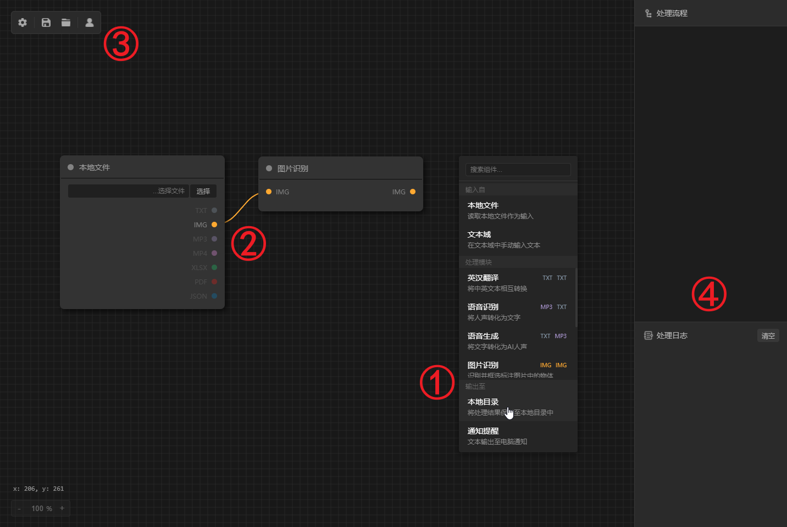
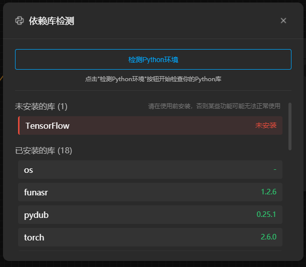

<h1 align="center">FilePipe - Visual Node-Based Workflow for File Processing</h1>

<p align="center">
  🇨🇳 <a href="./README.md">Chinese</a> | 🌐 <a href="./README.en.md">English</a>
</p>

> **Note**: This repository is for development use only.

## ✅ Recommended Environment

* Python `v3.10.7`
* Node.js `v18.17.0`

## 🚀 Getting Started

1. Install dependencies in the `/electron-vue` directory:
   ```
   npm install
   ```
2. Execute the following code under `/electron-vue` to start the program:
   ```
   npm run go
   ```

## 🖼️ UI Layout & Feature Overview



① Right-click on the canvas to open the **Create Component** menu

② Drag the output node to an input node with the same file format to **create a connection** between components

③ From left to right:

* Settings (Model Management, Dependency Checker, Configs)
* Save Current Workflow
* Open Local Workflow File
* Login (to access online workflow templates)

④ Workflow Execution Area

Only **complete workflows** (including input component, processing component, and output component) will appear here.

**A complete workflow looks like this:**


⑤ "RUN" Button

Click to **run the workflow**. While running, the button changes to “STOP” so the process can be interrupted at any time.

⑥Looper Configuration

Disabled by default. To enable:

1. Select a looper type
2. Set parameters
3. Click "Create"
4. Run the workflow

**Looper Types:**

* **Interval Looper**: Set the max number of executions and the time interval between runs. Starts executing on "RUN" and repeats based on the interval.
* **Time Looper**: Set one or more trigger times (24-hour format). After clicking "RUN", it will automatically execute daily at the specified times.
* **Folder Looper**: No setup required, but only works when the input component is a "Local File". It iterates through all files in the same folder with the same extension.

## ⚙️ Before Running a Workflow

The Python scripts used for file processing are located in the `/utils` directory.

Before executing a workflow, go to the **Dependency Management** section in the settings window of the application to check required libraries. Manually install any missing libraries. (Example below)


