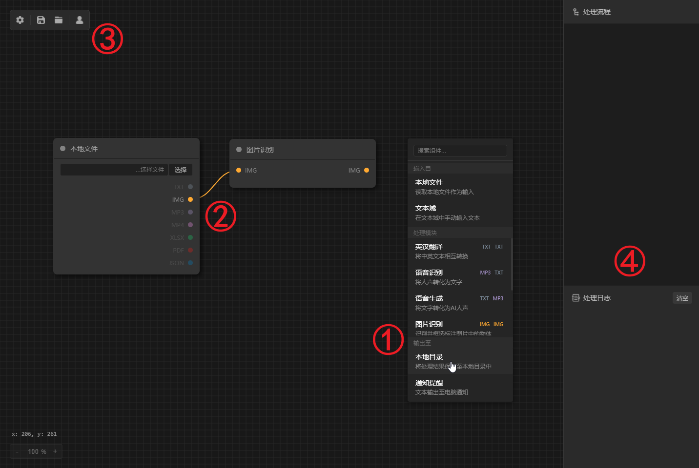
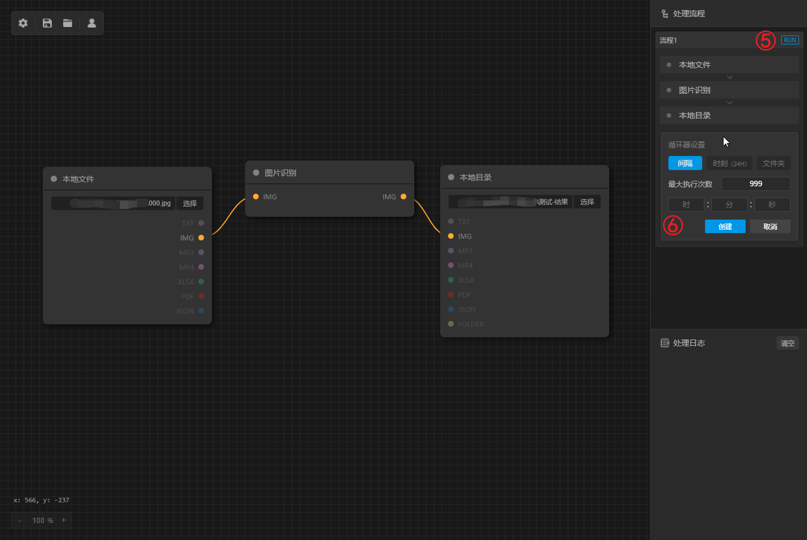
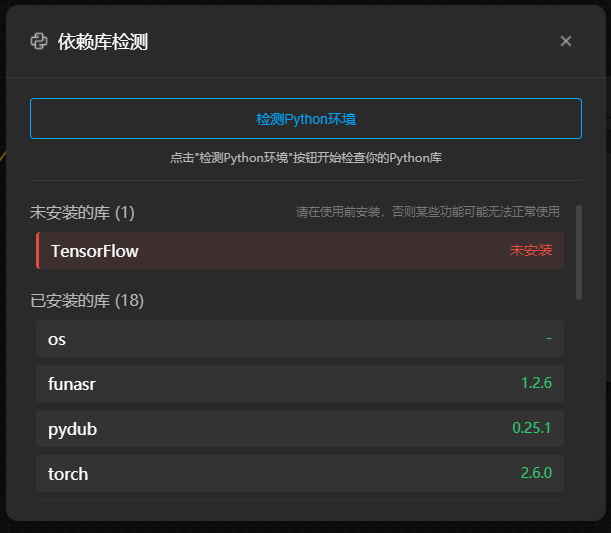

<h1 align="center">FilePipe - 使用可视化节点工作流来处理文件</h1>

<p align="center">
  🇨🇳 <a href="./README.md">中文</a> | 🌐 <a href="./README.en.md">English</a>
</p>

> *【注意】该仓库为开发环境*

## ✅ 推荐环境

* Python `v3.10.7`
* Node.js `v18.17.0`

## 🚀 启动程序

1. 进入 `/electron-vue` 下执行如下代码安装所需依赖：
   ```
   git install
   ```
2. 在 `/electron-vue` 下执行如下代码启动程序：
   ```
   npm run go
   ```

## 🖼️ 界面布局及功能说明



①鼠标右键在画布上打开菜单**创建组件。**

②将输出节点拖动至文件格式相同的输入节点即可**在两个组件之间建立连接。**

③从左到右依次为：设置（模型管理、依赖库检测、配置项）、保存当前流程、打开本地流程文件、登录（查看在线收藏流程模板）。

④处理流程操作界面，注意，只有完备的流程（兼具输入组件、处理模块组件以及输出组件）才会显示在此区域。

**一个完备的流程构建如下：**



⑤“RUN”按钮，点击即可**运行流程**，运行过程中其将变为“STOP”按钮，可随时中断流程。

⑥循环器默认处于关闭状态。要启用循环器，请按以下步骤操作：

1. 选择循环器类型
2. 设置相关参数（文件夹循环器无需设置）
3. 点击“创建”按钮
4. 运行工作流程

**循环器类型介绍：**

* **间隔循环器：**设置最大执行次数与执行时间间隔，点击“RUN”按钮后开始执行，之后的每次执行都将间隔设定的时间。
* **时刻循环器：**设置触发执行的时间点（24小时制），点击“RUN”按钮后，程序会在每天到达该时间点后自动执行。（时间点可设置多个）
* **文件夹循环器：**无需设置，但只能在输入组件也为“本地文件”组件时才可生效，该循环器会将流程在“本地文件”组件所选文件的同级所有后缀名相同的文件中遍历执行。

## ⚙️ 在开始执行流程前

本项目所使用的用于文件处理的 Python 脚本位于 `/utils`下。

在流程开始执行前，请进入**应用中设置下的依赖库管理窗口**检测 Python 脚本所需要的环境与依赖库，并自行安装未安装的库。（下图仅供示例）


